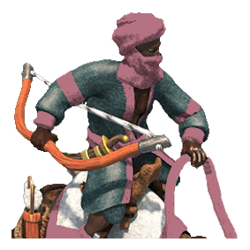

 

# unique-unit-masks 

SVG masks for Age of Empires II: Definitive Edition unique units

## How it works

We create a `div` with the unique unit as a background image. Inside this `div` we inject the corresponding SVG with [svg-inject (forked for stability reasons)](https://github.com/transparencies/svg-inject) and give the injected SVG a class of ours. From there on we can style the SVG as it would be inline.

## Usage

Check the [example](./example) folder. You will need a HTTP server to serve the files (e.g. `python -m http.server`).

## License

The svg masks in [./unique_units_masks](./unique_units_masks) are licensed under a <a rel="license" href="http://creativecommons.org/licenses/by-nc-sa/4.0/">Creative Commons Attribution-NonCommercial-ShareAlike 4.0 International License</a> (or see [local copy](./License.md)). If you want to obtain a *commercial license* you can contact the author using the [issues](https://github.com/transparencies/unique-unit-masks/issues).

## Disclaimer

Age of Empires II © Microsoft Corporation.

These assets were created under Microsoft's ["Game Content Usage Rules"](https://www.xbox.com/en-us/developers/rules) using assets
from Age of Empires II, we are not endorsed by or affiliated with Microsoft.
